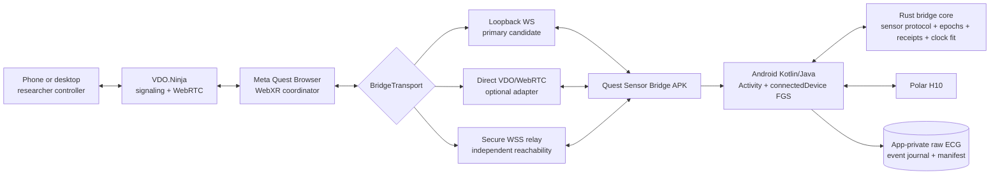

# Quest WebXR, BLE, and remote-control architecture

Status: host-implemented authority split plus proposed production qualification  
Date: 2026-08-30

## Decision

Keep the complete experiment in Meta Quest Browser and add a separate native
**Study 6 Sensor Bridge** APK. WebXR is the sole authority for questionnaire and
condition logic, progression, study revision, browser persistence, and study
export. The APK is not a Bluetooth permission shim and it is not an experiment
reducer. It is the sole owner of Polar H10 Bluetooth, continuous raw ECG,
sensor/recorder health, timestamped metadata markers, recorder finalization, and
the sensor artifact. WebXR talks to that provider through a versioned bridge
protocol.

Use this runtime split:

- **Meta Quest Browser / WebXR** owns the study reducer/revision, participant and
  questionnaire flow, condition allocation, progression, browser IndexedDB,
  study JSON/CSV export, rendering, and media effects.
- **Native Android bridge** owns only BLE/GATT, H10 readiness, continuous ECG,
  recording epochs/revisions, durable marker/sample storage, recorder
  finalization/sensor export, and the monotonic clock proposed for cross-runtime
  start barriers. It never decides a questionnaire or condition transition.
- **Phone/desktop controller** submits bounded experiment intents and displays
  aggregate status. It does not independently fan one start command out to two
  runtimes.
- **VDO.Ninja** remains the browser-to-browser spectator, remote-control, and
  low-rate telemetry path already used by this project.
- **Bridge transport adapters** carry the same application protocol between WebXR
  and the APK. Qualify an authenticated loopback WebSocket first; add a direct
  VDO/WebRTC APK peer as an optional adapter; add a neutral secure WSS relay when
  the APK must remain independently reachable from outside the headset.

The implemented command path is companion → WebXR → sensor bridge. A Rust relay
scaffold exists, but it is not production-wired, and there is no independently
reachable native VDO peer. The future-`T0` audio/ECG barrier is also not
production-wired. Physical Quest + H10 validation remains pending.

The participant first opens the APK, connects the H10, sees a live ECG readiness
screen, starts the foreground service and recording, and then presses **Launch
experiment**. The APK opens the exact pinned HTTPS deployment in Meta Quest
Browser. The current WebXR Start control remains gated until actual ECG
samples—not just a GATT connection—are arriving and the bridge reports a healthy
open writer. The future-`T0` barrier must add a measured clock-fit gate before any
synchronized-timing claim.

This preserves the browser deployment model while solving Bluetooth in the one
runtime that can reliably own it.

## Answers to the key questions

### Does this let WebXR access the H10?

Yes, indirectly. WebXR can receive:

- detected/connected/streaming state;
- heart rate, RR, sample rate, last-sample age, packet gaps, reconnect state, and
  storage health;
- a bounded live ECG waveform window for participant/researcher feedback;
- recording status and sensor effect receipts (block state remains WebXR-owned);
- in the proposed future-`T0` barrier, clock-fit and synchronization uncertainty.

WebXR can request sensor actions and recording markers, but the page never gets an
Android `BluetoothGatt` object and never becomes the BLE owner. The raw 130 Hz ECG
is written locally even if WebXR, VDO.Ninja, Wi-Fi, or the renderer fails.

### Can the APK and WebXR communicate directly through VDO.Ninja?

Technically yes. A data-only publisher/viewer pair creates one bidirectional
WebRTC DataChannel. The difficulty is the native peer, not the WebXR peer:

- the supported VDO.Ninja SDK targets browser JavaScript and Node;
- VDO's SDK documentation says direct access to its signaling WebSocket is not an
  approved integration and may be blocked or changed;
- no supported Kotlin or Rust Android binding was found;
- an invisible WebView running the JavaScript SDK is easy to prototype but is a
  weak background-service dependency;
- a Kotlin/libwebrtc, Flutter, or Rust peer requires an explicit compatibility and
  lifecycle project.

Therefore direct VDO is an adapter with a promotion test, not the only critical
path. The first production topology should be:

```text
phone/PC companion
        |
        | encrypted VDO.Ninja data-only WebRTC (optional spectator plane off)
        v
WebXR experiment coordinator
        |
        | authenticated transport-neutral bridge protocol
        | primary candidate: 127.0.0.1 WebSocket
        v
native BLE/ECG foreground service
```

When a native VDO peer passes the background/endurance gates, it can replace the
loopback adapter for the same sensor-recorder contract. It may also provide
independent sensor rescue/status reachability, but it cannot become a second
questionnaire or condition authority. Only one sensor-command transport epoch is
active at a time; duplicate messages on a failover path are deduplicated by
command ID and recording epoch.

### Can audio and ECG start at exactly the same time?

Do not start BLE recording when a network message arrives. Begin the continuous
ECG stream several seconds before the experiment and define a future monotonic
instant `T0` as the start of the trial's ECG window. Schedule browser audio for the
same `T0` after mapping clocks. This removes BLE startup, packet batching, WebRTC,
and network jitter from the onset path.

This is the target barrier design, not the behavior of the current controller.
The current implementation records ordinary metadata markers but does not yet
production-wire the future-`T0` prepare/offer/schedule/commit path.

It can produce measured, bounded software alignment. It cannot honestly promise
zero-error physical sound-at-the-ear to cardiac-sample alignment. Web Audio output
timestamps are estimates, the H10 has its own clock, and H10 packets batch samples.
Any sub-10-ms scientific claim requires hardware characterization and an external
acoustic/electrical reference.

## Evidence and platform constraints

### Meta Browser and Bluetooth

Meta documents Quest Browser as the supported runtime for hosted 2D, 3D, and
immersive WebXR content, including optional PWA packaging. Meta does not currently
document a usable Web Bluetooth contract. Independent Quest reports find that the
standard browser cannot complete a Web Bluetooth device selection even when API
feature detection is present. Treat Web Bluetooth as unavailable until a real
`requestDevice()` hardware test proves otherwise; property detection is not a
sufficient test.

Primary references:

- [Meta Quest Browser overview](https://developers.meta.com/horizon/documentation/web/)
- [Meta Browser specifications](https://developers.meta.com/horizon/documentation/web/browser-specs/)
- [Independent Quest PWA/Web Bluetooth test](https://web.dev/articles/pwas-on-oculus-2)

### Android background BLE

Android's prescribed mechanism for a long-lived GATT stream is a
`connectedDevice` foreground service, started while the app has a visible Activity
or another valid exemption. For modern target SDKs the APK needs Bluetooth runtime
permissions, `FOREGROUND_SERVICE`,
`FOREGROUND_SERVICE_CONNECTED_DEVICE`, and a service declared with
`android:foregroundServiceType="connectedDevice"`.

A foreground service raises process importance; it is not immortal. If Android or
the wearer stops the process, GATT closes. The bridge must persist continuously,
use fresh process/stream epochs, reconnect with bounded backoff, and surface every
gap. Quest 2, 3, and 3S require physical endurance qualification.

Primary references:

- [Android background BLE guidance](https://developer.android.com/develop/connectivity/bluetooth/ble/background)
- [Connected-device foreground-service type](https://developer.android.com/develop/background-work/services/fgs/service-types#connected-device)
- [Foreground-service background-start restrictions](https://developer.android.com/develop/background-work/services/fgs/restrictions-bg-start)
- [Android Bluetooth permissions](https://developer.android.com/develop/connectivity/bluetooth/bt-permissions)

### Polar H10 timing

Polar documents H10 ECG at 130 Hz, or one sample every approximately 7.692 ms.
Samples carry the sensor's timestamp in nanoseconds relative to Polar's 2000 epoch.
The H10 can reset its device time after shutdown and does not support reading its
time through the current Android API, so discontinuities and stream epochs must be
explicit. Callback arrival time is not sample time: BLE packets can contain many
samples and introduce variable delivery delay.

Primary references:

- [Polar H10 capabilities](https://github.com/polarofficial/polar-ble-sdk/blob/master/documentation/products/PolarH10.md)
- [Polar device time system](https://github.com/polarofficial/polar-ble-sdk/blob/master/documentation/TimeSystemExplained.md)
- [Polar Android API, including H10 time-read limitation](https://github.com/polarofficial/polar-ble-sdk/blob/master/sources/Android/android-communications/library/src/sdk/java/com/polar/sdk/api/PolarBleApi.kt)
- [Polar H10 known issues](https://github.com/polarofficial/polar-ble-sdk/blob/master/documentation/KnownIssues.md)

### Local browser-to-APK access

Chromium has historically treated `127.0.0.1` as potentially trustworthy and
allows HTTPS pages to reach loopback HTTP. Chrome's Local Network Access policy is
evolving and now includes loopback permission behavior; Meta Browser can diverge
from the corresponding Chrome milestone. An HTTPS GitHub Pages deployment opening
`ws://127.0.0.1` is therefore a strong low-latency candidate, not an assumption.
It is the first hardware proof gate.

Primary references:

- [Chrome Private Network Access: localhost behavior](https://developer.chrome.com/blog/private-network-access-update)
- [Chrome Local Network Access](https://developer.chrome.com/blog/local-network-access)
- [W3C Secure Contexts](https://w3c.github.io/webappsec-secure-contexts/)

### Tauri and immersive WebXR

Tauri Android uses the selected Android System WebView. It does not embed Meta
Quest Browser. Chromium's Android WebView configuration excludes WebXR and Web
Bluetooth. A Tauri application can be a useful 2D setup/status/launcher shell or a
desktop controller, and a Kotlin Tauri plugin can call a Rust core, but Tauri
should not be the immersive renderer.

Meta's current supported packaging path for a hosted immersive site is a
Bubblewrap-generated PWA/Trusted Web Activity with `horizonOSAppMode=immersive` and
Digital Asset Links. That can improve installation and launch UX, but it does not
give the hosted page native BLE ownership.

Primary references:

- [Tauri Android WebView runtime](https://tauri.app/reference/webview-versions/)
- [Chromium statement that WebXR is disabled in WebView](https://groups.google.com/a/chromium.org/d/msgid/blink-dev/00000000000031066705e613ef2f%40google.com)
- [Meta PWA overview](https://developers.meta.com/horizon/documentation/web/pwa-overview/)
- [Meta Quest PWA packaging](https://developers.meta.com/horizon/documentation/web/pwa-packaging/)

## Existing assets to preserve

The current WebXR repository contains the implemented browser companion base:

- [`src/companion/protocol.ts`](../src/companion/protocol.ts) defines strict
  privacy-minimized status, random 256-bit pairing material, and the versioned
  pairing descriptor. Its older AES-GCM envelope remains only for the unwired
  experimental WSS relay.
- [`src/companion/vendor/browser-remote-sync-protocol/brsp.js`](../src/companion/vendor/browser-remote-sync-protocol/brsp.js)
  is the pinned MIT BRSP/1 transport-neutral core.
- [`src/companion/brsp-vdo-peer-transport.ts`](../src/companion/brsp-vdo-peer-transport.ts)
  adds reliable ordered control and unordered zero-retry latest-state channels to
  a data-only WebRTC peer. Optional spectator monitoring is independent and off
  by default.
- [`src/companion/host.ts`](../src/companion/host.ts) is the BRSP target. It proves
  the pairing secret, grants narrow scopes, enforces the WebXR revision, and sends
  WebXR-authoritative status plus APK-derived sensor-recorder telemetry.
- [`src/companion/viewer.ts`](../src/companion/viewer.ts) is the 2D remote peer.
- [`src/companion/vdo-sdk.ts`](../src/companion/vdo-sdk.ts) pins and integrity-checks
  VDO.Ninja SDK 1.5.5.
- [`src/study/remote.ts`](../src/study/remote.ts) has a strict domain allowlist,
  revision guard, local opt-in, and privacy-minimized status.
- [`src/app/controller.ts`](../src/app/controller.ts) remains the owner of WebXR
  study transitions.

The companion study-command schema and the APK sensor-recorder schema are
intentionally different authority surfaces. A later version may generate their
shared envelope/receipt primitives, but must not merge questionnaire/condition
commands into the APK allowlist.

The current media player calls `HTMLVideoElement.play()` and
`HTMLAudioElement.play()` together. That is suitable for ordinary playback but not
for a scheduled scientific onset. The synchronized path must replace the audio
side with decoded Web Audio buffers and schedule `AudioBufferSourceNode.start()`.
Video can remain muted and follow the audio clock, with its first presented frame
logged separately.

Earlier Study 6 Android work already contains the important H10 behavior to
extract rather than reinvent:

- foreground/native permission and service patterns;
- a process-wide physiology session;
- real ECG sample readiness gates;
- H10 PMD control/data setup and 130 Hz streaming;
- sensor timestamps plus host UTC and `elapsedRealtimeNanos()` receipts;
- continuous master recording and per-block windows;
- sample/gap/reconnect/MTU/QC status.

MesmerPrism's [Rusty Quest](https://github.com/MesmerPrism/rusty-quest) and
[Rusty Manifold](https://github.com/MesmerPrism/rusty-manifold) provide useful
patterns for a bounded RFC 6455 service, process/transport/provider epochs,
one-use admission, monotonic revisions, receipts, and the distinction between
transport acceptance and application effect. Reuse those contracts and small
components where compatible; do not import the whole product graph or its current
BLE-free broker assumptions.

The Affect Tracker/Flubber implementations provide a second useful split:

- reliable ordered messages for deployment/configuration and commands;
- latest-state, bounded, drop-tolerant binary updates for live motion/preview;
- sequence, RTT, gap, stale-source, and recovery diagnostics.

Those data-lane patterns are reusable. Public rooms, unauthenticated discovery,
and the old coordinate packet are not suitable for experiment authority or ECG.

## Target components



### Android layer

Use native Kotlin/Java for:

- runtime permission UX and H10 selection;
- BLE scan/GATT or the official Polar Android SDK;
- foreground-service lifecycle and persistent notification;
- Android audio APIs if native audio becomes necessary;
- app-private storage and explicit export;
- launching the allowlisted HTTPS study URL;
- coarse JNI calls to the Rust core.

Do not send every ECG sample across JNI. Submit immutable batches with sensor and
host timestamps to avoid call overhead and ownership hazards.

### Rust core

Rust is valuable for portable, testable sensor-provider logic rather than for
replacing stable Android APIs or moving study authority out of WebXR. A small core
may own:

- canonical versioned message types and validation;
- recording, process, stream, page, and transport epochs;
- sensor command IDs, idempotency, replay fencing, and deadlines;
- recorder/provider state machines and recording-revision checks;
- clock-fit calculations and uncertainty;
- effect receipt and audit-journal models;
- bounded RFC 6455 framing/queues if adapted from Rusty Quest;
- deterministic simulation and fuzz tests.

It should not own Android permission prompts, Activities, foreground-service
start rules, or GATT callbacks.

### APK setup/readiness UI

The first screen should make the original native control gate explicit:

1. Bluetooth permission state.
2. H10 identity selection/confirmation.
3. Detected, connecting, connected, PMD configuring, ECG streaming.
4. Live bounded waveform plus HR/RR.
5. Current ECG rate, last sample age, gaps, reconnect count, MTU, battery if
   available, and storage free/healthy.
6. Bridge transport and clock-sync readiness.
7. **Launch experiment**, enabled only after policy thresholds pass.
8. Stop/finalize/export controls and an emergency local stop.

Starting the visible Activity first is important: it obtains permissions and
legally starts the foreground service before Meta Browser takes focus.

## Authority boundaries

| Parameter or effect | Sole authority | Other roles |
| --- | --- | --- |
| Study page, block order, questionnaire route, experiment revision | WebXR study controller | Controller submits intents; APK observes block IDs |
| Browser recovery, questionnaire/condition record, study JSON/CSV export | WebXR IndexedDB/export layer | APK receives no answers or participant demographics |
| Remote-control lease and safe study command admission | WebXR coordinator | Wearer grants/revokes; controller holds a short lease |
| Bluetooth connection and H10 stream epoch | APK sensor provider | WebXR/controller request desired state and observe receipts |
| Raw ECG bytes and durable file | APK recorder | WebXR/controller receive health/preview only |
| Sensor readiness/QC revision | APK sensor provider | WebXR gates starts against it |
| Stimulus/media state | WebXR media provider | APK receives scheduled barrier and outcome |
| Trial `T0` reference and ECG marker | Planned APK monotonic barrier service | WebXR maps/schedules against it; not production-wired |
| Companion pairing/control key | WebXR local onboarding coordinator | Wearer explicitly enables/revokes it |
| APK launch/bootstrap token | APK bridge admission | Single-use capability for the allowlisted WebXR origin |
| VDO signaling and relay | Transport only | Never decides or proves experiment effects |

There is no shared mutable "started" Boolean. A compound block start has two
provider outcomes—media and ECG marker—and the coordinator reports complete only
after both are observed.

No questionnaire response, demographic value, condition decision, page, or study
revision is accepted from the APK. WebXR sends only correlation metadata needed
to label the recorder artifact, and an APK receipt can confirm only a sensor or
recorder effect.

The controller must never send separate start commands to both providers. It sends
one `start_block` intent to WebXR. WebXR validates its study revision and then runs
the bridge barrier. Any future direct controller-to-APK commands are restricted
to sensor setup, read-only status, recorder finalization/export, and an idempotent
emergency sensor stop. They never advance or revise the experiment.

## Communication planes

### Control plane

Reliable, ordered, encrypted, bounded JSON/CBOR:

- pairing/capabilities;
- leases and commands;
- snapshots and revisions;
- prepare/commit/cancel barriers;
- effect receipts and errors.

### Telemetry plane

Bounded latest-state updates:

- 1–5 Hz sensor and experiment health;
- RTT, loss, reconnect, clock uncertainty;
- optional waveform windows or downsampled preview.

Use a separate drop-tolerant binary lane for waveform preview if needed. A slow
viewer is skipped rather than allowed to build an unbounded queue.

### Data plane

Raw 130 Hz ECG, the recorder marker journal, and sensor manifests remain in APK
app-private storage and durable. Sensor export is an explicit operation. Network
failure never pauses or corrupts recording. The separate WebXR study record
remains in browser IndexedDB.

### Media plane

Spectator video remains VDO.Ninja browser-to-browser media. It must not share
backpressure or completion semantics with the command plane.

## Version 2 protocol

For a future protocol revision, generate shared envelope and sensor-recorder
types for TypeScript, Rust, and Kotlin while keeping the WebXR study reducer out
of the APK schema. An envelope needs at least:

```json
{
  "protocol": "spatial.study6.bridge.v2",
  "session_id": "...",
  "session_epoch": 7,
  "page_epoch": 3,
  "bridge_epoch": 2,
  "transport_epoch": 5,
  "message_id": "uuid",
  "command_id": "uuid-or-null",
  "sender_role": "webxr",
  "target": "sensor.h10",
  "sequence": 42,
  "expected_revision": 19,
  "issued_monotonic": 123456789,
  "deadline_monotonic": 123466789,
  "kind": "command",
  "body": {}
}
```

Here `session_id` is a pseudonymous correlation identifier supplied by WebXR; it
does not transfer session authority to the APK.

Message families:

- `hello`, `capabilities`, `recording_snapshot`;
- `clock_probe`, `clock_reply`, `clock_model`;
- `sensor_connect`, `sensor_disconnect`, `recording_begin`, `recording_finalize`;
- `prepare_block`, `barrier_offer`, `commit_ready`, `commit_start`,
  `cancel_before_deadline`;
- `status_snapshot`, `status_patch`, `waveform_preview`;
- `decision`, `effect_receipt`, `error`.

Receipt stages are deliberately separate:

```text
received -> authorized -> accepted -> persisted -> applied -> observed
```

A WebRTC/WebSocket ACK proves only delivery. It is not proof that BLE connected,
that samples were written, or that audio reached its scheduled timeline. An APK
receipt never proves that the WebXR study reducer advanced; that is evidenced by
WebXR's persisted study revision and audit trail. Compound sensor/timing results
are:

- `complete`;
- `failed_precondition`;
- `partially_applied`;
- `outcome_unknown`.

Absolute sensor desired-state commands are idempotent. Relative `advance`/`back`
are WebXR study commands and are not part of the APK protocol; after an ambiguous
companion disconnect, fetch a fresh WebXR study snapshot before reconciling.

## Synchronized WebXR/audio/ECG events

### Clock domains

Log, identify, and never conflate these clocks:

| Clock | API/source | Epoch handling |
| --- | --- | --- |
| Bridge monotonic | Android `SystemClock.elapsedRealtimeNanos()` | Bridge process/boot identity |
| Browser monotonic | `performance.now()` | Page/navigation epoch |
| Audio render | `AudioContext.currentTime` | AudioContext epoch/state |
| Audio output estimate | `AudioContext.getOutputTimestamp()` | Maps audio to browser performance time |
| H10 samples | Polar sample timestamp | H10 boot/stream epoch and reset detection |
| Human-readable audit | UTC wall clock | Never used for interval scheduling |

Android recommends `elapsedRealtimeNanos()` as a monotonic general-purpose
interval clock that continues through deep sleep. Web Audio schedules a buffer
source at a time in the `AudioContext.currentTime` coordinate system, and
`getOutputTimestamp()` supplies an estimated mapping between the currently
rendered audio sample and `performance.now()`.

References:

- [Android `SystemClock`](https://developer.android.com/reference/android/os/SystemClock)
- [Web Audio scheduled source start](https://www.w3.org/TR/webaudio-1.0/#dom-audioscheduledsourcenode-start)
- [`AudioContext.getOutputTimestamp()`](https://developer.mozilla.org/en-US/docs/Web/API/AudioContext/getOutputTimestamp)

### Browser-to-bridge clock fit

Run repeated four-timestamp probes. For browser timestamps `B1`, `B4` and bridge
timestamps `A2`, `A3`, all converted to nanoseconds:

```text
offset = ((A2 - B1) + (A3 - B4)) / 2
rtt    = (B4 - B1) - (A3 - A2)
```

Retain low-RTT observations and fit an affine mapping:

```text
A = alpha + beta * B
```

Store `alpha`, drift `beta`, RTT distribution, residual, sample count, validity
window, and uncertainty. Refit periodically and after page resume, transport
failover, audio route change, or headset sleep. Never use `Date.now()` to align
the runtimes.

### Start barrier

The sequence below is the intended production contract. It is not currently
wired into the WebXR controller or APK recorder and has no Quest/H10 timing
qualification.

1. **Pre-roll.** The bridge starts continuous ECG and durable writing at least
   several seconds before a possible stimulus.
2. **Browser arm.** A local participant gesture creates/resumes the `AudioContext`,
   fetches and decodes the exact audio asset, and enters immersive XR. This is a
   prerequisite; a remote controller cannot bypass browser autoplay or WebXR user
   activation rules.
3. **Preflight.** WebXR checks its revision, media hash, visibility/XR state, audio
   state, and clock uncertainty. The bridge checks actual PMD samples, last-sample
   age, gaps, disk, sensor epoch, and recording journal.
4. **Offer.** The bridge reserves a barrier and returns a future `T0` in bridge
   monotonic time. Initial lead time should be conservative—about 1–2 seconds—and
   later derived from measured p99 scheduling/transport latency.
5. **Schedule.** WebXR maps `T0` into browser performance time and then into audio
   context time. It creates a new decoded `AudioBufferSourceNode` and calls
   `start(audioT0)`. The bridge durably writes a future ECG-window marker containing
   `T0`; no BLE operation has to wake exactly at `T0`.
6. **Commit.** WebXR returns its scheduled receipt before the cancellation
   deadline. The bridge persists the commit and returns a commit receipt. If either
   side misses the deadline, cancel before `T0` and do not silently start one side.
7. **Observe.** After `T0`, WebXR records the audio output estimate and media state;
   the bridge records the H10 samples bracketing `T0`, mapping uncertainty, and
   file offsets. Only then does the controller display **Started**.

If `getOutputTimestamp()` exists, estimate the audio-context target from its
current mapping:

```text
audioT0 = output.contextTime
        + (browserPerformanceT0 - output.performanceTime) / 1000
```

Feature-detect and record `baseLatency`/`outputLatency`. If output timestamp support
is missing or unstable on the target Meta Browser build, use a measured fallback
mapping and label the result degraded.

### H10 sample alignment limit

The ECG window begins at `T0`; the radio stream does not. Persist:

- raw sensor timestamp for every sample;
- host monotonic receipt timestamp for every packet/batch;
- sample index and packet boundaries;
- the two samples bracketing mapped `T0`;
- the sensor-to-host fit and its uncertainty;
- every H10 time reset or stream epoch.

Setting H10 wall time is not enough to claim millisecond alignment. The H10 cannot
read its clock through the current Android API, and independent reports show
non-trivial set-time skew. Estimate the sensor/host relationship continuously from
timestamped batches and characterize the fixed bias with hardware. Packet receipt
must never be substituted for sample time.

### If stricter timing is required

Keep an `audio_owner` capability in the protocol with exactly one value per
session:

- `webxr`: recommended first, preserves web assets and spatial/browser behavior;
- `bridge`: native Android `AudioTrack` owns playback and can expose Android audio
  presentation timestamps, at the cost of native asset caching and duplicated
  media control;
- `native_immersive`: strategic fallback if the required physical tolerance cannot
  be demonstrated across the browser boundary.

Moving audio into the APK removes the browser/bridge clock mapping from playback,
but it does not automatically solve H10 sensor-clock uncertainty. An acoustic
microphone loopback or external DAQ/electrical marker is still required to validate
sound-at-ear versus ECG sample time.

### Timing acceptance gate

Do not specify a scientific tolerance solely from API documentation. Measure it on
every supported headset/browser/H10 combination. Record at least:

- browser/bridge clock-fit residual and uncertainty;
- requested versus estimated audio presentation time;
- ECG sample period and sensor/host mapping uncertainty;
- first WebXR state/render observation;
- total alignment uncertainty and confidence;
- firmware, browser, APK, WebXR build, audio route, and transport versions.

At 130 Hz one ECG sample is approximately 7.692 ms. If validation cannot prove the
study's chosen bound, report the measured bound or promote native audio/native XR;
do not label it exact.

## Complete remote controller

The implemented BRSP profile exposes a bounded action list grouped into logical
scopes. Extend its monitoring model around the following surfaces without moving
their authority.

### Experiment surface

All fields and decisions on this surface are WebXR-owned:

- connect/pair and acquire/release control lease;
- participant/session present, route, language, XR/visibility;
- current block, condition, media identity/hash, progress, pause/resume;
- safe start, pause, resume, advance, back, abort, finalize;
- local-user-action-required and technical-hold states;
- authoritative revision and effect receipts.

### Sensor surface

All facts and effects on this surface are APK-derived:

- permission/service state;
- selected sensor and H10 firmware/battery when available;
- scan/detected/connected/PMD/streaming substates;
- HR/RR, ECG sample count/rate, last-sample age, gaps and reconnects;
- file/session ID, bytes written, storage free/healthy, recording epoch;
- transport RTT and clock uncertainty;
- bounded waveform preview;
- connect/reconnect/finalize/export requests admitted by WebXR against its role
  and study state, then applied by the APK as sensor-recorder effects.

### Controller UX rules

- Show **Delivered**, **Accepted**, and **Effect observed** separately.
- Disable Start unless both WebXR and sensor preflight are green.
- A stale revision forces refresh, not an automatic retry.
- A lost sensor or bridge during a block enters an explicit technical hold or the
  study's predeclared continue-with-gap policy.
- Never expose participant IDs, demographics, answers, or raw ECG in public VDO
  discovery/status messages.
- The headset wearer can revoke remote control and perform emergency stop locally.

## Security and privacy

### Local admission

- Bind only `127.0.0.1` and optionally `::1`, never all interfaces.
- Use the literal loopback address, not DNS-resolved `localhost`.
- Allowlist the exact pinned GitHub Pages origin in HTTP CORS and WebSocket Origin.
- Validate Host, protocol, message sizes, rates, roles, sequence, expiry, and
  revisions.
- Generate a 256-bit single-use, short-lived token per APK launch.
- Put bootstrap material in the URL fragment so it is not sent to the web server.
- Rotate all tokens and epochs after process restart or explicit revoke.
- Keep application-level authenticated encryption even when the transport is
  encrypted.

The APK should launch only an allowlisted URL containing a pinned build/manifest
hash, for example:

```text
https://example.github.io/spatial-study-6-webxr/
  #bridge=<single-use-descriptor>&build=<expected-hash>
```

### VDO and relay admission

The current AES-GCM envelope is a good base. Derive separate role keys for
controller, WebXR, and sensor bridge rather than sharing one room secret with every
viewer. The VDO room/stream ID is routing metadata, not authorization.

If a secure WSS relay is added, end-to-end encrypt payloads so the relay sees only
bounded routing/connection metadata. A relay or TURN receipt is never an
application effect receipt.

### Storage

- Keep study state, conditions, questionnaire responses, browser audit events,
  and study JSON/CSV export in the WebXR origin's IndexedDB/export layer.
- Write to app-private storage with crash-safe chunking/flush policy.
- Maintain an append-only ECG/marker journal and a final sensor manifest with
  hashes.
- Keep raw ECG off remote control channels by default.
- Keep participant-entered demographics and questionnaire answers out of the APK
  marker protocol.
- Export browser-study and APK-sensor artifacts only through explicit
  local/researcher actions, then correlate them by pseudonymous session/event IDs.
- Define retention, deletion, pseudonymous session IDs, and interrupted-file
  recovery before deployment.

## Failure behavior

| Failure | Required behavior |
| --- | --- |
| VDO/operator disconnect | Local WebXR and ECG continue; controller reconciles from snapshots on return |
| WebXR-to-APK link loss before start | Start rejected; recording continues; UI shows bridge unavailable |
| Link loss during block | ECG continues; log gap in control link; apply explicit hold/continue policy |
| Browser reload/crash | New page epoch; recover WebXR study state from IndexedDB, reconcile APK recording status, and never reconstruct a block from APK state |
| APK process death | GATT closes; new bridge/stream epoch; page enters technical hold; previous file remains recoverable |
| H10 disconnect | Log exact gap; bounded reconnect; never report streaming from GATT connection alone |
| Headset sleep/resume | Invalidate clock fit and pending barriers; recalibrate before next start |
| AudioContext suspended/route change | Cancel pending barrier or mark degraded; require local resume gesture if needed |
| Ambiguous relative command | Report `outcome_unknown`; fetch snapshot; never blind-retry |
| Disk pressure/write error | Disable new starts and surface hard failure; never claim a valid recording |
| Transport failover | Increment transport epoch; deduplicate by command ID; one command path at a time |

## Option scorecard

| Option | Immersive WebXR | BLE background | Directness | Stability | Decision |
| --- | --- | --- | --- | --- | --- |
| Quest Browser + native FGS + loopback | Yes | Yes | Best local path | Must qualify LNA/WS on Meta Browser | Primary candidate |
| Quest Browser + native FGS + direct VDO peer | Yes | Yes if native peer is correct | P2P after signaling | Native VDO lifecycle/API work | Optional adapter |
| Quest Browser + native FGS + neutral WSS relay | Yes | Yes | One WAN hop | Native-friendly, observable, NAT-safe | Add for independent remote reachability |
| Tauri Android WebView + BLE plugin | No reliable immersive XR | Possible | In-process IPC | Good for 2D only | Setup/launcher or controller |
| Meta immersive PWA/TWA + separate bridge | Yes, documented packaging path | Bridge still required | Similar to Browser | Good distribution UX; native messaging unproven | Packaging option |
| Sideloaded Chromium with Web Bluetooth | Uncontrolled | Browser-bound | Direct API | Distribution/update/XR risk | Qualification experiment only |
| Fully native immersive app | Yes, native | Yes | Single process | Best timing/offline, largest rewrite | Strategic fallback |

## Implementation and qualification plan

### Phase 0 — freeze contracts and test the platform assumptions

1. Define one `bridge.v2` sensor-recorder schema with generated TS/Rust/Kotlin
   types; keep the WebXR companion study-command schema separate.
2. Add a transport simulator with duplicates, reordering, stale revisions, expired
   commands, process epochs, disconnect ambiguity, and bounded queues.
3. On Quest 2, 3, and 3S test from the exact GitHub Pages origin:
   - user-activated loopback health request;
   - loopback WebSocket creation in 2D and immersive mode;
   - permission denial/regrant and Content Security Policy;
   - p50/p95/p99 RTT under WebXR load for 60–120 minutes.
4. Test a real Web Bluetooth `requestDevice()` only to record the platform fact;
   do not make it the plan.
5. Feature-test Web Audio output timestamps and measure scheduled acoustic onset.

Exit: one bridge transport is proven on target firmware, and the timing APIs have
measured behavior rather than assumed support.

### Phase 1 — native sensor bridge MVP

1. Extract the proven Study 6 H10 manager/session/file contracts.
2. Build the setup/readiness screen and `connectedDevice` foreground service.
3. Start continuous 130 Hz recording before launching Meta Browser.
4. Add crash-safe files, event journal, session/stream epochs, reconnect/gap/QC
   status, and explicit stop/finalize.
5. Add the Rust core only across coarse JNI boundaries; keep the Android service
   functional if Rust-side UI/web components do not exist.

Exit: 1–2 hour real-H10 recording while Meta Browser is immersive, with Activity
destroy/recreate, menu use, Wi-Fi loss, strap removal, and sleep/wake tests. There
are no silent gaps or false-ready states.

### Phase 2 — WebXR bridge and native control gate

1. Implement `BridgeTransport` and the qualified adapter.
2. Add capabilities, recorder snapshots, sensor command/effect receipts,
   recording revisions, and reconnect reconciliation.
3. Gate WebXR Start on real ECG, storage, clock, media, and XR readiness.
4. Add bounded live waveform/status panels to WebXR and the 2D companion.
5. Keep raw recording local and measure that preview load cannot starve file IO.

Exit: browser can monitor and command the bridge without owning Bluetooth; losing
the browser does not stop recording.

### Phase 3 — complete remote controller

1. Consolidate shared v1 envelope/receipt primitives without merging the WebXR
   experiment vocabulary into the APK sensor vocabulary.
2. Add WebXR-owned experiment and APK-derived sensor surfaces, role-derived keys,
   leases, explicit local opt-in, emergency sensor stop, and privacy-minimized
   snapshots.
3. Show pending/accepted/observed/failed/outcome-unknown state for every command.
4. Add audit/export/finalization visibility and technical-hold workflows.
5. Run TURN, reconnect, stale-message, controller-sleep, and multi-viewer tests.

Exit: a phone/PC can operate the armed experiment and honestly monitor both WebXR
and ECG state without split-brain.

### Phase 4 — scheduled timing

1. Replace `HTMLAudioElement.play()` onset with decoded Web Audio scheduling.
2. Implement continuous affine clock fit and uncertainty thresholds.
3. Implement prepare/offer/commit/cancel and durable future markers.
4. Persist browser/audio/bridge/H10 raw timestamps and effect receipts.
5. Validate with acoustic/electrical reference hardware across headset/audio routes.

Exit: an empirical error distribution and a defensible study tolerance exist for
every supported hardware/software combination.

### Phase 5 — optional transports and packaging

1. Prototype a direct APK VDO peer using an explicitly chosen supported/forked
   implementation; do not reverse-engineer VDO's public signaling WebSocket as a
   hidden dependency.
2. Require long-run background, screen/activity, Wi-Fi roaming, TURN, duplicate,
   reconnect, and SDK-upgrade compatibility tests before promotion.
3. Add a neutral end-to-end-encrypted WSS relay if independent remote APK control is
   operationally required.
4. Evaluate Meta's immersive PWA/TWA for distribution and a Tauri 2D researcher
   client—not Tauri as the immersive renderer.

Exit: transport selection is operational configuration, not a fork of experiment
logic.

## Current production gaps

The checked-in host implementation is intentionally below the participant-use
boundary:

- the future-`T0` audio/ECG prepare/offer/schedule/commit barrier is not wired
  into the production WebXR controller and APK recorder;
- the experimental Rust relay is not wired into WebXR/APK failover, and no
  production native VDO peer provides independent APK reachability; and
- the authority split, loopback transport, foreground BLE endurance, live Polar
  H10 recording, visual parity, and physical audio/ECG onset have not been
  qualified on the target Quest hardware.

## Mandatory hardware test matrix

Record Quest model, Horizon OS build, Meta Browser version/user agent, Android
WebView provider (for Tauri tests), APK commit/signature, WebXR build hash,
VDO.Ninja SDK version, H10 firmware, permissions, audio route, and service exit
reason for each run.

Test at minimum:

- Quest 2, Quest 3, and Quest 3S;
- 60–120 minutes of immersive WebXR plus continuous real H10 ECG;
- headset removal, display off, sleep/wake, universal menu, and thermal load;
- Activity destruction/relaunch while the foreground service remains;
- H10 out-of-range, strap removal, PMD failure, reconnect, and battery cleanup;
- Wi-Fi loss, roam, reconnect, direct ICE and forced TURN;
- browser refresh/crash and APK process stop/restart;
- loopback permission accept/deny/regrant;
- controller sleep/rejoin and two attempted controllers;
- duplicate, stale, expired, out-of-order, and ambiguous commands;
- audio autoplay/user activation, output timestamp support, route changes, and
  externally measured onset;
- low storage, write failure, partial file recovery, finalize, export, and delete.

## Recommended first delivery slice

Build a narrow proof before a full product:

1. Native Activity with the original ECG readiness panel.
2. `connectedDevice` foreground service streaming and writing a real H10 at 130 Hz.
3. One authenticated loopback endpoint with `hello`, `status`, `clock_probe`, and
   `mark_event` only.
4. A WebXR diagnostic panel that shows bridge state/waveform and refuses to mark an
   event unless the bridge is ready.
5. An APK button that launches the pinned GitHub Pages URL with a single-use token
   in the fragment.
6. A 90-minute Quest run with latency, sample gaps, process state, and clock error
   captured.

That slice answers the highest-risk question—whether Meta Browser and a real Quest
foreground BLE service coexist and communicate reliably—before investing in a
native VDO peer, Tauri shell, relay, or full remote-control UI.
